# LPU Bot RAG System - Complete Workflow Explained

## 📚 Overview

Your bot uses **RAG (Retrieval-Augmented Generation)** - a technique that combines document search with AI generation to answer questions accurately using your university's knowledge base.

---

## 🔄 System Architecture

```mermaid
graph TB
    A[📄 PDF/Text Documents] -->|1. Ingest| B[Document Loader]
    B -->|2. Split| C[Text Chunks]
    C -->|3. Embed| D[Google Embeddings API]
    D -->|4. Store| E[(ChromaDB Vector Database)]
    
    F[👤 User Query] -->|5. Embed| G[Google Embeddings API]
    G -->|6. Search| E
    E -->|7. Retrieve| H[Relevant Chunks]
    H -->|8. Build Context| I[Prompt Template]
    I -->|9. Generate| J[Ollama gemma2:2b]
    J -->|10. Stream| K[✨ AI Response]
```



---

## 📖 Phase 1: Document Ingestion (Setup Phase)

### File: `src/ingest.py`

This runs **once** when you add new documents to build your knowledge base.

### Step 1: Load Documents
```python
# Finds all documents in data/ folder
all_files = find_files(".pdf") + find_files(".docx") + find_files(".txt")
```

**Supported formats:** PDF, Word (.docx, .doc), Text (.txt), JSON

### Step 2: Auto-Categorize by Directory
```python
data/
├── academics/     → doc_type="regulation"
├── hostel/        → doc_type="hostel"
├── maps/          → doc_type="map"
└── exams/         → doc_type="regulation"
```

**Why?** Enables smart filtering later (e.g., "Where is Block 34?" only searches maps)

### Step 3: Smart Chunking
Different document types get different chunk sizes:

| Document Type | Chunk Size | Overlap | Why? |
|---------------|------------|---------|------|
| **Maps** | 350 chars | 50 | Location info is concise |
| **Regulations** | 800 chars | 100 | Policies need full context |
| **Hostel** | 600 chars | 100 | Rules are detailed |
| **General** | 500 chars | 100 | Balanced |

```python
# Example chunk:
"Block 34 is located in the northern section of campus, 
near the parking lot P3. It houses the Computer Science 
department on floors 2-4..."
```

### Step 4: Create Embeddings
```python
embeddings = GoogleGenerativeAIEmbeddings(model="models/text-embedding-004")
```

**What is an embedding?**  
Converts text → 768-dimensional vector (list of numbers) that captures meaning.

**Example:**
- "Where is Block 34?" → [0.23, -0.45, 0.67, ..., 0.12]
- "Block 34 location" → [0.21, -0.43, 0.69, ..., 0.15]
- → **Similar vectors** = Similar meaning!

### Step 5: Store in Vector Database
```python
vectorstore = Chroma(persist_directory="./db", embedding_function=embeddings)
vectorstore.add_documents(chunks, ids=[uuid1, uuid2, ...])
```

**Result:** All 59 batches (590 chunks) stored in `./db/` folder

---

## 🔍 Phase 2: Query Processing (Runtime)

### File: `src/rag_pipeline.py` → `answer_question()`

This runs **every time** a user asks a question.

### Step 1: User Sends Query
```
User types: "What's the hostel curfew time?"
```

### Step 2: Check for Timetable Queries (Special Case)
```python
timetable_keywords = ["class", "schedule", "timetable", ...]
if any(keyword in query.lower() for keyword in timetable_keywords):
    # Skip RAG, go directly to timetable lookup
    return search_timetable(student_id, query)
```

### Step 3: Intent Detection
```python
def identify_intent(query):
    if "where is" in query or "location" in query:
        return {"doc_type": "map"}  # Only search maps
    elif "fee" in query or "scholarship" in query:
        return {"doc_type": "regulation"}  # Only search regulations
```

**Result:** Faster, more accurate search by filtering document types

### Step 4: Vector Search (MMR Algorithm)
```python
docs = vectorstore.max_marginal_relevance_search(
    query="What's the hostel curfew time?",
    k=4,                    # Return top 4 chunks
    filter={"doc_type": "hostel"},  # Only hostel docs
    fetch_k=15,             # Initially fetch 15 candidates
    lambda_mult=0.7         # Balance relevance vs diversity
)
```

**What happens:**
1. **Embed query** → [0.45, -0.23, 0.78, ...]
2. **Compare** to all 590 stored vectors
3. **Rank** by similarity (cosine distance)
4. **MMR diversification** - avoid redundant results
5. **Return** top 4 most relevant chunks

**Example results:**
```
[Hostel Rules.pdf]
Students must return to hostel by 10:30 PM on weekdays 
and 11:00 PM on weekends. Late entry requires warden permission...

[Hostel FAQ.pdf]
Curfew time: 10:30 PM (Mon-Fri), 11:00 PM (Sat-Sun).
Emergency late arrivals: Contact warden at...
```

### Step 5: Build Context
```python
context_parts = []
for doc in docs:
    source = doc.metadata['source']
    page_content = doc.page_content[:800]  # Limit each chunk
    context_parts.append(f"[{source}]\n{page_content}")

context = "\n\n---\n\n".join(context_parts)
```

**Result (2000 chars max):**
```
[Hostel Rules.pdf]
Students must return to hostel by 10:30 PM on weekdays...

---

[Hostel FAQ.pdf]
Curfew time: 10:30 PM (Mon-Fri), 11:00 PM (Sat-Sun)...
```

### Step 6: Create Prompt
```python
template = """You are JARVIS, a university assistant.

CONTEXT:
{context}

QUESTION:
{query}

ANSWER (detailed):"""

prompt = template.format(
    context=context,
    query="What's the hostel curfew time?"
)
```

### Step 7: Generate Response with LLM
```python
llm = ChatOllama(
    model="gemma2:2b",
    base_url="http://localhost:11434",
    temperature=0.7,
    num_predict=250
)

response = llm.invoke(prompt)
```

**What the LLM sees:**
```
You are JARVIS...

CONTEXT:
[Hostel Rules.pdf]
Students must return by 10:30 PM weekdays...

QUESTION:
What's the hostel curfew time?

ANSWER:
```

**LLM generates:**
```
The hostel curfew time is **10:30 PM on weekdays** (Monday-Friday) 
and **11:00 PM on weekends** (Saturday-Sunday). Late entry requires 
prior permission from the warden. For emergency situations, you can 
contact the warden directly.
```

### Step 8: Stream to User
```python
for chunk in llm.stream(prompt):
    yield chunk.content  # Send word-by-word to UI
```

**User sees:** Real-time typing effect in the chat interface

---

## 🌐 Phase 3: Web Interface

### File: `web_app.py`

### FastAPI Backend
```python
@app.post("/ask_stream")
async def ask_stream(query: str, student_id: str):
    return EventSourceResponse(answer_question_stream(query, student_id))
```

### Frontend (JavaScript)
```javascript
// User clicks send
async function sendMessage() {
    const query = chatInput.value;
    
    // Send to backend
    const response = await fetch('/ask_stream', {
        method: 'POST',
        body: JSON.stringify({ question: query })
    });
    
    // Stream response
    for await (const chunk of response.body) {
        displayChunk(chunk);  // Show in chat UI
    }
}
```

---

## 💾 Data Flow Summary

### One-Time Setup (Ingestion)
```
Documents → Load → Chunk → Embed → Store in DB
  (PDFs)    (590)   (590)   (590)     (ChromaDB)
```

### Every Query (Runtime)
```
Query → Embed → Search DB → Get Chunks → Build Context → LLM → Response
 "?"    [vec]   (similarity)    (4)        (2000ch)     (AI)     "!"
```

---

## 🔧 Key Components Explained

### 1. **Embeddings (Google Gemini API)**
- **Purpose:** Convert text to vectors for similarity search
- **Model:** text-embedding-004 (768 dimensions)
- **Cost:** API calls (0.5-2s latency per query)

### 2. **Vector Database (ChromaDB)**
- **Purpose:** Fast similarity search across 590 chunks
- **Storage:** `./db/` folder (~50 MB)
- **Algorithm:** Cosine similarity + MMR

### 3. **LLM (Ollama gemma2:2b)**
- **Purpose:** Generate human-like responses from context
- **Size:** 2 billion parameters (~2 GB RAM)
- **Speed:** ~4-8 seconds per response
- **GPU:** Auto-detected via `OLLAMA_NUM_GPU=1`

### 4. **RAG Pipeline**
- **Retrieval:** Get relevant chunks from DB
- **Augmentation:** Add chunks to prompt
- **Generation:** LLM creates answer from context

---

## 📊 Performance Characteristics

| Stage | Time | What Happens |
|-------|------|--------------|
| **Embed Query** | 0.5-2s | Google API call |
| **Search DB** | 0.1-0.3s | Vector similarity search |
| **Build Context** | 0.05s | String concatenation |
| **LLM Generate** | 3-5s | AI inference on gemma2:2b |
| **Total** | **4-8s** | End-to-end response |

---

## 🎯 Special Features

### Timetable Integration
```python
if is_timetable_query(query):
    # Bypass RAG entirely
    timetable_data = get_user_timetable(student_id)
    return search_timetable(timetable_data, query)
```

**Stored in:** `data/users/{student_id}.json`

### Metadata Filtering
```python
# Only search maps for location queries
filter = {"doc_type": "map"}
docs = vectorstore.search(query, filter=filter)
```

**Result:** 10x faster search, better accuracy

### Streaming Responses
```python
async def answer_question_stream(query):
    for chunk in llm.stream(prompt):
        yield f"data: {json.dumps({'chunk': chunk})}\n\n"
```

**User Experience:** See response appear word-by-word

---

## 🔄 Complete Request Flow

```
1. User opens http://localhost:8000
2. Types: "What's the hostel curfew?"
3. JavaScript sends POST to /ask_stream
4. FastAPI receives request
5. answer_question_stream() called
6. Check timetable keywords → No match
7. identify_intent() → {doc_type: "hostel"}
8. Load vectorstore from ./db/
9. Embed query via Google API → [0.45, -0.23, ...]
10. Search DB with filter="hostel" → Get 4 chunks
11. Build 2000-char context from chunks
12. Create prompt with context + query
13. Send to Ollama gemma2:2b
14. Stream tokens back: "The", "hostel", "curfew", ...
15. JavaScript displays in chat UI
16. User sees complete answer in 4-8 seconds
```

---

*This is your current workflow with the original configuration (4-8s response time)*
